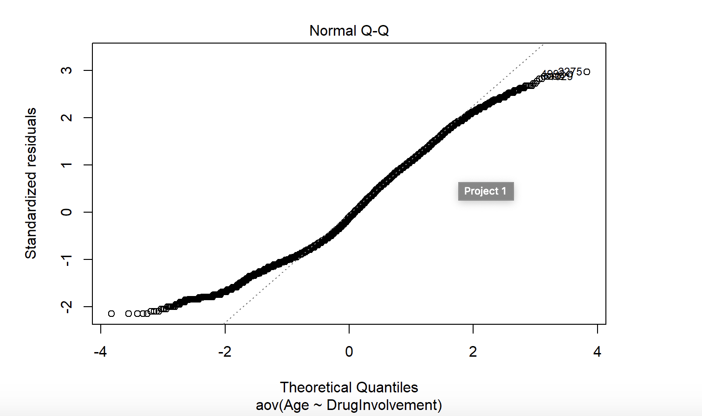
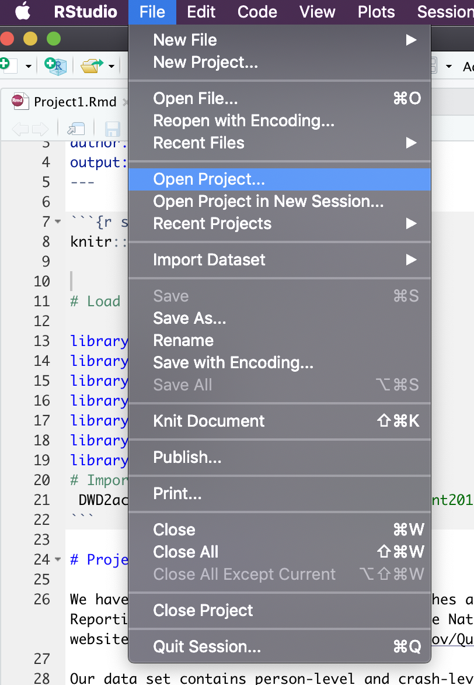
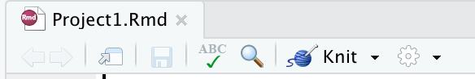

# Car Crash Data Analysis

The goal of this project is demonstrate understanding of statistical concepts by answering questions on different topics using a dataset of car accidents in 2017. The first topics covered in this project are random/theoretical Chi-Squared Tests, Anova,  associations, and PostHocTests.  

### Getting Started 

To run this project download and unzip the files from this directory and open the ModelingSuicideData.Rproj file inside of RStudio. 

Then open the Project1.Rmd file, you may need to install required libraries. 

Finally, select knit to run the program and receive the Project1.html output file

### Built With 

* RStudio - IDE

### Authors 

* Kyle Dennison - KyleDennison
